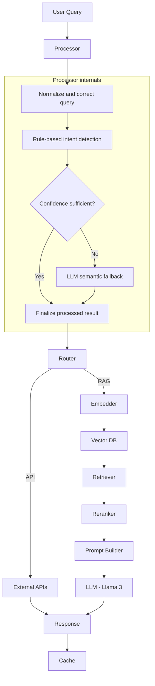

# 🚀 AI Financial Assistant & Stock Forecasting System

<p align="center">
  <b>AI-Powered Financial Assistant Combining RAG + Machine Learning + LLM</b><br/>
  Analyze • Answer • Forecast the Vietnamese Stock Market
</p>

<p align="center">
  
  
  
  
  
</p>

---

## 📌 Overview

This project is an **AI Financial Assistant** designed to:

- 🧠 Understand financial questions in Vietnamese
- 🔎 Retrieve relevant information from real-world data using Retrieval-Augmented Generation (RAG)
- 📰 Analyze financial news and market sentiment
- 📈 Forecast stock prices using Machine Learning models
- 🤖 Generate intelligent, context-aware responses with a Large Language Model (LLM)

👉 Goal: Build an **advanced AI assistant specialized in the Vietnamese stock market**.

---

## ✨ Demo Use Cases

```text
• What is the current price of FPT stock?
• What are today's major VN-Index news highlights?
• Should I buy HPG stock?
• Forecast VCB's next trading session.
```
## 🧠 Kiến trúc hệ thống


`Processor` hoàn tất việc hiểu câu hỏi trước khi chuyển sang `Router`: chuẩn hóa
văn bản, sửa lỗi miền tài chính, nhận diện intent/ticker/thời gian bằng rule và
chỉ dùng LLM semantic fallback nội bộ khi độ tin cậy thấp. Semantic fallback
không phải là một node độc lập trong pipeline. `Router` chỉ dựa trên kết quả đã
xử lý để chọn nhánh API hoặc RAG.
      
## 🔥 Key Features

### 🧠 1. Semantic Understanding & Intent Detection

- Automatically identifies:
  - Stock symbols (VCB, FPT, HPG, etc.)
  - User intent (price inquiry, news, forecast, etc.)
- Supports natural Vietnamese language queries
- Normalizes and preprocesses user input before entering the AI pipeline

---

### 🔍 2. Hybrid Search (Advanced RAG)

Combines multiple retrieval techniques:

- Dense Embeddings (Semantic Search)
- BM25 (Keyword Search)
- Reciprocal Rank Fusion (RRF)
- Cross-Encoder Reranking

👉 This hybrid approach significantly improves retrieval accuracy compared to using a single retrieval method.

---

### 📰 3. Financial Data Pipeline

- Crawls financial news from CafeF
- Cleans and normalizes raw text
- Splits documents into optimized chunks for retrieval
- Extracts structured information, including:
  - Stock symbols
  - Market indices (VN-Index, VN30, etc.)
  - Sentiment (Positive / Negative / Neutral)

---

### 🤖 4. LLM Integration

- Model: **Llama-3 8B Instruct (vLLM)**
- Generates responses grounded in retrieved context
- Produces answers that are:
  - Natural
  - Concise
  - Easy to understand
---

### 📈 5. Stock Price Forecasting (Machine Learning)

Model: **SARIMAX (Time Series Forecasting)**

Uses multiple data sources:
  - Historical stock prices
  - News sentiment
  - Market indices

👉 Predicts:
- Next trading session's closing price
- Upward or downward trend
- Prediction confidence

---

### ⚡ 6. Intelligent Caching

- Redis for real-time caching
- Local file storage as a fallback
- Stores conversation history
- Reduces latency and LLM inference costs

---

### 🔄 7. Automated Data Pipeline

- Periodically crawls new financial data
- Removes duplicate records
- Continuously updates the Vector Database
- Ensures knowledge remains fresh and up to date

---

## 🏗️ Tech Stack

### 🤖 AI / NLP

- Sentence Transformers  
- BM25 (rank_bm25)  
- Cross-Encoder (reranking)  
- Llama-3 (vLLM)  

---

### 📊 Machine Learning

- SARIMAX (statsmodels)  
- Pandas  
- NumPy  

---

### 🗄️ Data

- Qdrant (Vector Database)  
- Redis (Caching)  

---

### 🌐 Data Sources

- CafeF (Financial News)  
- VNStock API  

---

### ⚙️ Backend

- Python  
- LangGraph (Pipeline orchestration)  

